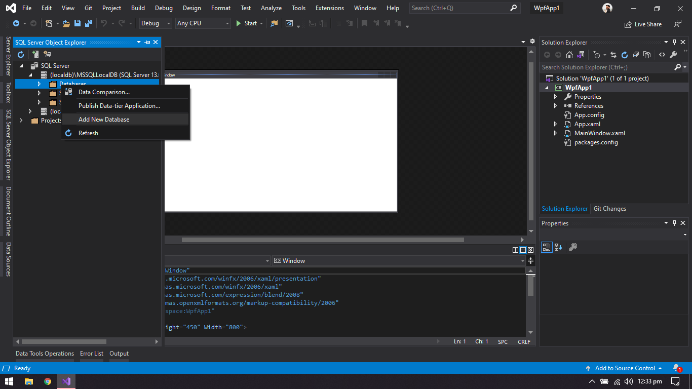

# Grocery Store WPF App

A Grocery Store GUI based application. Have 2 types of users, i.e. Admin &amp; Customer. 
The data is stored using SQL Local Database.

## Working of the App

### Admin

### Customer

## Installation

Install the .NET Framework in the MS Visual Studio. 
Clone the repository and open it.

### Requirements to be installed
1. Microsoft.Data.SqlClient package installed
2. New database is added
3. Two tables, i.e. Customers &amp; Products are added

### Installing Package

Go to Tools > NuGet Package Manager > Manage NuGet Packages for Solution...

Then search for "Microsoft.Data.SqlClient"

Install the package in the project

### Adding Database

Go to View > SQL Server Object Explorer

Go to "(localdb)\MSSQLLocalDB...."
and then right-click on Databases and Add New Database

### Adding Tables

Go to the created database, right-click on Tables and Add New Table

Add the "Customers" table as follows and click on Update

Also, Add "Products" table as follows and click Update

### Author

#### Muhammad Ahmad Khan

Let's get connected!

You can also follow my GitHub Profile to stay updated about my latest projects:

If you liked the repo then kindly support it by giving it a star ⭐!

Copyright (c) 2020 MUHAMMAD AHMAD KHAN
